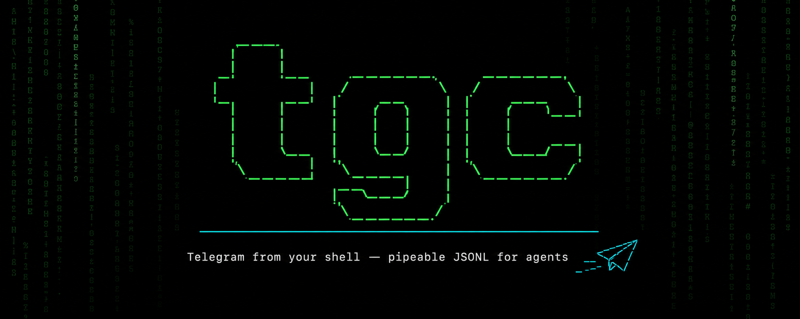

<div align="center">



# tgc

**Telegram CLI для агентов, написанный на Go.**

Работает по MTProto через [gotgproto](https://github.com/celestix/gotgproto) и
[gotd/td](https://github.com/gotd/td) — пишет компактный JSONL в stdout и
структурированные JSON-ошибки в stderr, поэтому агент может передавать и
разбирать каждый результат.

<p>
  <a href="https://github.com/grigoreo-dev/tgc/releases"></a>
  <a href="https://go.dev"></a>
  <a href="https://core.telegram.org/mtproto"></a>
  
  <a href="LICENSE"></a>
</p>

<p>
  <a href="https://github.com/grigoreo-dev/tgc/actions"></a>
  <a href="https://golangci-lint.run"></a>
  
  
</p>

[English](README.md) · [Установка](#установка) · [Быстрый старт](#быстрый-старт) · [Команды](#команды) · [Документация](#документация)

</div>

```console
$ tgc send @user "**привет**" --await-reply
{"id":42,"chat_id":123,"date":"2026-07-19T12:00:00Z","text":"привет","sender_id":123}
{"id":43,"chat_id":123,"date":"2026-07-19T12:00:04Z","text":"здарова!","sender_id":456}
```

Добавьте `--pretty`, когда вывод читает человек.

## Установка

Рекомендуемый способ (Go не нужен — скачивается бинарник релиза):

```sh
curl -fsSL https://raw.githubusercontent.com/grigoreo-dev/tgc/main/install.sh | sh
```

Переменные: `TGC_VERSION=vX.Y.Z` для конкретной версии, `TGC_INSTALL_DIR` для
каталога установки (по умолчанию `~/.local/bin`), `GITHUB_TOKEN`/`GH_TOKEN`
чтобы обойти лимиты API, `TGC_NO_SETUP=1` чтобы пропустить настройку
PATH/completion после установки.

После установки скрипт запускает `tgc self setup`: в новых сессиях оболочки
`tgc` оказывается в PATH, а completion для bash/zsh/fish ставится в
пользовательские каталоги. Сбой setup — только предупреждение, сам бинарник
уже установлен. Отключить автозапуск: `TGC_NO_SETUP=1`. Повторить вручную:
`tgc self setup`; откатить: `tgc self setup --remove` (удаляет только
управляемый блок в rc и помеченные файлы).

`tgc completion <shell>` **генерирует** скрипт completion в stdout (для ручной
установки). `tgc self setup` **устанавливает** те же скрипты в стандартные
пользовательские пути. Для обычной работы предпочитайте setup.

zsh: управляемый блок в `~/.zshrc` обновляет `fpath` до загрузки completion —
оставьте `compinit` после этого блока (в типичных конфигах так и есть).

Хотите сначала проверить скрипт? Скачайте `install.sh`, прочитайте его, затем
запустите.

Альтернатива (нужен Go 1.25+):

```sh
go install github.com/grigoreo-dev/tgc/cmd/tgc@latest
```

> Сборка через `go install` сообщает версию `dev` и **не** проверяет обновления
> и не умеет self-update. Для автоматических проверок и `tgc self update`
> устанавливайте через скрипт выше. После `go install` один раз выполните
> `tgc self setup`, если нужна та же настройка PATH/completion.

### Обновление

```sh
tgc self update    # download and install the latest release
tgc self check     # report {"update_available":...} without installing
```

Пока доступен более новый релиз, tgc при каждом запуске печатает в stderr
одну строку `{"warning":"update_available",...}`. Установите
`TGC_NO_UPDATE_CHECK=1`, чтобы полностью отключить проверку. После успешного
update помеченные файлы completion, установленные через `tgc self setup`,
обновляются.

> Безопасность: релизы проверяются по sha256-контрольной сумме по HTTPS.
> Проверка подписи издателя (cosign) планируется в будущих релизах.

## Быстрый старт

Получите `api_id` и `api_hash` на [my.telegram.org](https://my.telegram.org),
затем войдите:

```sh
tgc auth login --phone +NNN        # аккаунт пользователя
tgc auth login --bot-token $TOKEN  # аккаунт бота
```

После входа:

```sh
tgc chats
tgc send @user "**hi**"
tgc read @user --limit 10
```

## Команды

Выполните `tgc --help` для полного списка; `tgc <команда> --help` для флагов
каждой команды.

| Команда | Назначение |
|---------|------------|
| `auth`     | Управление сессиями Telegram (вход, список, экспорт, импорт, выход). |
| `chats`    | Список диалогов (кэш 5 мин; `--fresh` для обновления). |
| `info`     | Показать карточку чата или пользователя (id, type, title; username, phone, about, members_count, bot, premium при наличии). |
| `members`  | Список участников группы. |
| `search`   | Поиск чатов и сообщений (по умолчанию оба); `--type chats\|messages\|user\|group\|channel` — сузить; `--chat <peer>` — искать внутри одного чата (`--from`, `--since`, `--until`). |
| `read`     | Читать историю чата, сначала новые. |
| `await`    | Ждать входящие сообщения, вывести их и отметить прочитанными. |
| `context`  | Показать сообщение вместе с окружающими его сообщениями. |
| `send`     | Отправить сообщение (по умолчанию Markdown; `--file` для медиа; `--await-reply` — дождаться ответа). |
| `edit`     | Отредактировать своё сообщение. |
| `delete`   | Удалить сообщения (по умолчанию для всех; `--for-me` — оставить для других). |
| `forward`  | Переслать сообщение в другой чат. |
| `download` | Скачать медиа из сообщения. |

## Контракт вывода

- **stdout** содержит только результаты — компактный JSONL, по одному
  JSON-объекту в строке. Это поведение по умолчанию, чтобы агенты могли
  передавать вывод прямо в парсер.
- **stderr** содержит ошибки — одну структурированную JSON-строку
  (`{"error":"<code>","message":"..."}`), и процесс завершается с кодом 1.
- `--pretty` переключает stdout на человекочитаемые таблицы вместо JSONL.

### Коды ошибок

Ошибки используют стабильный набор машиночитаемых кодов:

| Код | Значение |
|-----|----------|
| `ambiguous`          | Селектор совпал с несколькими чатами; кандидаты — в теле ошибки. |
| `bad_args`           | Неверные аргументы или флаги. |
| `bad_config`         | Не удалось разобрать файл конфигурации или переменную окружения. |
| `bot_unsupported`    | Команда недоступна для аккаунтов ботов. |
| `flood_wait`         | Telegram ограничил частоту запросов; повторите после ожидания. |
| `io_error`           | Локальная файловая операция завершилась ошибкой. |
| `no_api_credentials` | `api_id`/`api_hash` не заданы. |
| `no_media`           | В целевом сообщении нет медиа для скачивания. |
| `not_authenticated`  | Нет сессии для выбранного профиля. |
| `not_found`          | Не удалось найти чат, пользователя или сообщение. |
| `rich_unsupported`   | Аккаунт отклонил rich-сообщение (`--rich`). |
| `upload_failed`      | Загруженный файл вернулся непригодным для использования. |

## Переменные окружения

| Переменная | Действие |
|------------|----------|
| `TGC_PROFILE`      | Активный профиль (то же, что `--profile`). |
| `TGC_API_ID`       | Telegram `api_id`. |
| `TGC_API_HASH`     | Telegram `api_hash`. |
| `TGC_SESSION`      | Импортировать строку сессии напрямую, без файла сессии. |
| `TGC_CONFIG_DIR`   | Переопределить корень конфигурации/профилей. Также учитывается `XDG_CONFIG_HOME`. |
| `TGC_DOWNLOAD_DIR` | Корень для скачиваний; по умолчанию `~/.tgc/downloads`. |
| `NO_COLOR`         | Отключить цвета в режиме `--pretty`. |

## Профили

tgc хранит именованные профили, выбираемые через `--profile` или `TGC_PROFILE`.
Каждый профиль хранит свою сессию в каталоге конфигурации, и профиль — это либо
вход пользователя, либо вход бота. Это позволяет держать, например, личный
аккаунт и бота рядом и переключаться между ними для каждой команды.

## Локальная конфигурация проекта (`./.tgc`)

Выполните `tgc init` в каталоге проекта, чтобы создать локальную конфигурацию
`./.tgc`, — тогда этот каталог (и его подкаталоги) будут использовать свой
аккаунт по умолчанию:

    tgc init --profile work
    tgc auth login

tgc ищет конфигурацию в таком порядке: `TGC_CONFIG_DIR` → ближайший `./.tgc`
при подъёме вверх от текущего каталога (но не выше домашнего каталога) →
`$XDG_CONFIG_HOME/tgc` → `~/.config/tgc`. Общий родительский `workspace/.tgc`
покрывает все подпроекты; более близкий `./.tgc` его переопределяет. Каталог
`.tgc` прямо в домашней директории не используется как локальный конфиг —
для этого есть `~/.config/tgc`.

`tgc init` записывает `.tgc/.gitignore` (`*`), чтобы сессии никогда не попадали
в коммиты, и наследует `api_id`/`api_hash` из вашей глобальной конфигурации,
если они заданы. Посмотреть активную конфигурацию:

    tgc config path

## Ограничения режима бота

Аккаунт бота не может получить список диалогов или выполнить `search` — оба
случая возвращают `bot_unsupported`, потому что Telegram не даёт ботам список
диалогов и поиск контактов. Бот может отправлять и читать сообщения в чатах, где
он состоит: адресуйте пользователя по `@username` или по числовому id
пользователя, который уже написал боту.

## Ожидание входящих (диалоги для агентов)

Когда агенту нужен ответ собеседника, а не снимок истории, `tgc await`
блокируется до прихода непрочитанных сообщений, выводит их, отмечает
прочитанными и завершается — это примитив «дождаться ответа», без цикла опроса.

```sh
tgc await @user                       # ждать, пока придёт сообщение
tgc await @user --timeout 30          # сдаться через 30 секунд
tgc send @bot "ping" --await-reply    # отправить и ждать ответ на одном соединении
```

`await` использует дебаунс: он ждёт паузы, прежде чем вернуть результат, поэтому
серия сообщений (или медиа-группа) собирается в один пакет. Сообщения выводятся
от старых к новым, по одному компактному JSON-объекту в строке — той же формы,
что и у `read`:

```json
{"id":42,"chat_id":123,"date":"2026-07-19T12:00:00Z","text":"hi","sender_id":123, ...}
```

Если до истечения таймаута сообщений нет, `await` печатает маркер и завершается
с кодом 0 (это штатный исход, а не ошибка):

```json
{"status":"timeout","chat_id":123,"waited":30}
```

| Флаг | Команда | По умолчанию | Действие |
|------|---------|--------------|----------|
| `--timeout`   | `await` | `300` | Максимум секунд ожидания до вывода маркера таймаута. |
| `--debounce`  | `await` | `2`   | Секунд тишины перед возвратом пакета (`0` — выключено). |
| `--from`      | `await` | —     | Только сообщения от этого отправителя (селектор). |
| `--await-reply`    | `send` | `false` | После отправки ждать ответ на том же соединении. |
| `--await-timeout`  | `send` | `300` | `--await-reply`: максимум секунд ожидания. |
| `--await-debounce` | `send` | `2`   | `--await-reply`: секунд тишины перед возвратом пакета. |
| `--await-from`     | `send` | —     | `--await-reply`: только сообщения от этого отправителя. |

> **Побочный эффект — отметка о прочтении:** `await` отмечает полученные
> сообщения прочитанными, а это **видимое собеседнику действие** (у него
> продвигается статус «прочитано»). Так и задумано — сообщения потребляются, —
> но это не тихий просмотр.

> **Одно ожидание на профиль:** профиль держит одну сессию MTProto, поэтому
> нельзя запускать два `await` (или `send --await-reply` рядом с другим `await`)
> одновременно на одном профиле. Параллельные агенты должны использовать
> **разные профили** (`--profile` / `TGC_PROFILE` или локальный `./.tgc` на
> проект).

> Боты работают **только вживую**: без подтягивания непрочитанного и без отметки
> о прочтении, поэтому `await` бота ловит только сообщения, пришедшие во время
> ожидания. `--await-reply` не поддерживается вместе с `--file`.

Скрипт-харнесс для бот-стороны (только для разработки), проверяющий эти сценарии,
находится в [scripts/await-e2e.sh](scripts/await-e2e.sh).

## Rich-сообщения

**Отправка.** По умолчанию Markdown отображается через сущности сообщений
Telegram, которые поддерживают все аккаунты. Существует и серверный путь для
rich-сообщений, но аккаунты пользователей отклоняют его с ошибкой
`RICH_MESSAGE_UNSUPPORTED`, поэтому tgc прозрачно возвращается к сущностям.
Полное исследование и результат живого запуска см. в
[docs/rich-spike.md](docs/rich-spike.md).

**Чтение.** Rich-сообщения Telegram (Bot API 10.1) хранят тело в дереве
rich-блоков (`tg.Message.RichMessage`) с пустым полем `text`. `read`, `context`
и `await` рендерят это дерево — заголовки, жирный/курсив/спойлер, код, списки,
цитаты, таблицы, формулы и inline-ссылки на медиа — в Markdown в поле `text` и
добавляют `"rich": true`. Если inline-копия усечена (или полная загрузка
пропущена/не удалась), также ставится `"rich_truncated": true`. Недоверенный
текст экранируется, чтобы отправитель не мог подделать разметку.

## Участие в разработке

Мы рады вкладу. Локальный процесс повторяет CI: если проверки проходят у вас,
они пройдут и в пайплайне.

**Подготовка**

```sh
git clone https://github.com/grigoreo-dev/tgc
cd tgc
go build ./...
```

**Перед созданием PR** запустите те же проверки, что и CI:

```sh
go build ./...
go vet ./...
go test ./...
shellcheck install.sh   # если правили скрипт установки
```

Держите изменения сфокусированными, следуйте существующей структуре пакетов в
`internal/` и сохраняйте [контракт вывода](#контракт-вывода) — результаты как
JSONL в stdout, структурированные ошибки в stderr. Изменения, видимые
пользователю, должны обновлять README (и `README.md`).

**Живой e2e-набор.** В `scripts/e2e/` лежит двунаправленный набор живых тестов,
гоняющий tgc против реальных тестовых аккаунтов (пользователь и бот). CI его не
запускает — нужны учётные данные и отдельные одноразовые аккаунты. Предпосылки и
запуск `scripts/e2e/run-all.sh` — см. [scripts/e2e/README.md](scripts/e2e/README.md).

### Трекинг задач через beads (`bd`)

Задачи в этом репозитории отслеживаются с помощью
[beads](https://github.com/gastownhall/beads) (`bd`) — git-нативного трекера с
учётом зависимостей. Он не обязателен для отправки PR, но если вы хотите взять
существующую задачу или скоординировать крупное изменение:

```sh
bd ready                     # список свободных, доступных задач
bd show <id>                 # задача и её зависимости
bd update <id> --claim       # атомарно взять её (назначает вас исполнителем)
bd close <id> --reason "..." # отметить выполненной
```

Как внешний контрибьютор, инициализируйте beads в **режиме контрибьютора**,
чтобы ваши планировочные задачи уходили в отдельный локальный репозиторий и не
попадали в PR:

```sh
bd init --contributor
```

Указывайте id задачи в сообщениях коммитов (например, `tgc-a1b2: fix flood-wait
backoff`), чтобы изменение можно было проследить до исходной задачи.

## Документация

- Проектная спецификация: [docs/superpowers/specs/2026-07-13-tgc-telegram-cli-design.md](docs/superpowers/specs/2026-07-13-tgc-telegram-cli-design.md)
- План реализации: [docs/superpowers/plans/2026-07-14-tgc-v1-implementation.md](docs/superpowers/plans/2026-07-14-tgc-v1-implementation.md)
- Чек-лист живой интеграции: [docs/integration-checklist.md](docs/integration-checklist.md)
- Спайк по RichMessage: [docs/rich-spike.md](docs/rich-spike.md)
